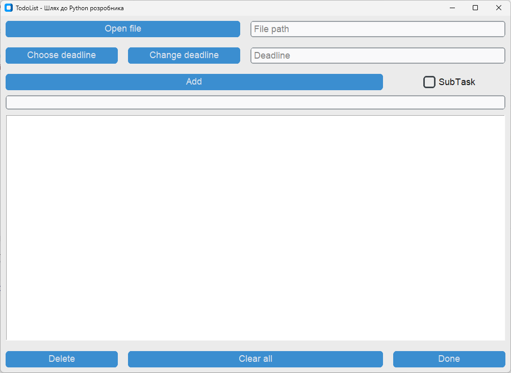

# Todolist mini-project in Python

## Description:
TodoListApp is a simple application for managing a 
list of tasks and subtasks using a graphical user interface (GUI) 
based on the Tkinter library.

## Key Features:

### Opening and Saving Task Lists:
-    Users can open existing task lists from a file.
-    The task list is saved to a file after any modifications.

### Adding Tasks:
- Users can add new tasks with specified deadlines.
- Ability to add subtasks for each task.

### Deadline Management and Task Completion:
- Ability to modify the deadline for a task.
- Marking a task as completed.

### Deletion and Clearing:
- Ability to delete both main tasks and subtasks. 
- Option to clear the entire task list.

## Interface:

### Opening a File:
- The `Open file` button allows users to select a 
file to load the task list.
-  The `File path` input field displays the selected file path.

### Adding Tasks:
 - Input fields for task text and deadline.
 - The `Add` button adds a new task to the list.
 - A highlighted task and an active checkbox allow you to 
add a subtask using the `Add` button

### Deadline Management:
- The `Choose deadline` and `Change deadline` buttons allow
users to select and modify task deadlines.

### Marking Tasks as Completed:
- The `Done` button marks the selected task as completed.

### Task Deletion:
- The `Delete` button deletes the selected task or subtask.

### List Clearing:
- The `Clear all` button completely clears the task list.

## External Dependencies:

The Tkinter library is used for creating the graphical user interface.
Built-in modules such as `json`, `datetime`, `os`, `filedialog`, and `messagebox` 
are used for data and file operations.

## Code Structure:

The code is organized into methods and functions for readability and 
understanding.
The customtkinter (ctk) library is used for styling Tkinter widgets.
### Appearance Mode
The appearance mode decides, which color will be picked from tuple colors, 
if the color is specified as a tuple color. You can set the appearance mode 
at any time with the following command:
<pre>
customtkinter.set_appearance_mode("system")  # default
customtkinter.set_appearance_mode("dark")
customtkinter.set_appearance_mode("light")
</pre>
If you set the appearance mode to **system**, the current mode is read from 
the operating system. It will also adapt if the appearance mode of the operating 
system changes during the runtime of the program. Note that on Linux it will be 
always in **light** mode if set to **system**, because the mode can't get read from 
the operating system at the moment

### Themes

By default all colours are set by the color theme. Currently there a three themes 
available: **blue**, **dark-blue** and **green**, 
where **blue** is the standard theme. All themes provide tuple colors 
for a light and dark appearance mode.

You can set the theme at the beginning of your programm
<pre> 
# Themes: "blue" (standard), "green", "dark-blue"
customtkinter.set_default_color_theme("dark-blue") 
</pre>

## Running the Application:

If the file is run directly (not imported), an instance of 
TodoListApp is created, and its mainloop() method is called 
to display the GUI.

## Extension and Contribution:

The project can be extended by adding new features or 
improved according to user needs.
Methods such as `add_task`, `delete_task`, `mark_as_done`, etc.,
are provided for contributing to the project.

## License:

There is no specific license mentioned in the code. 
It is recommended to add a clear license notice for other 
developers.